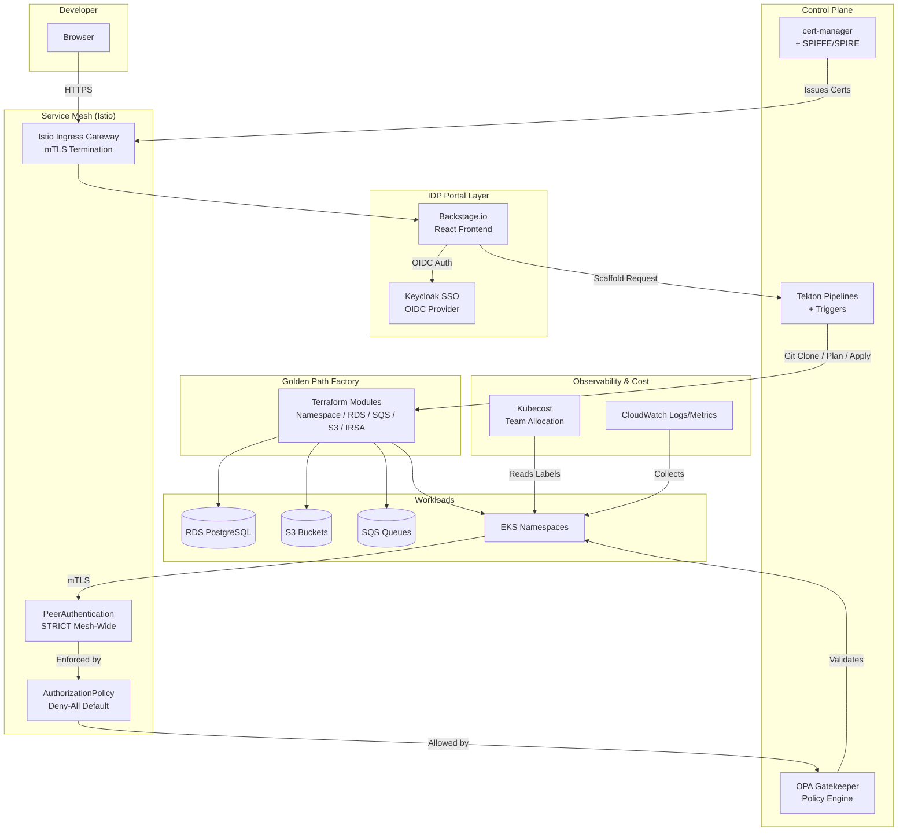
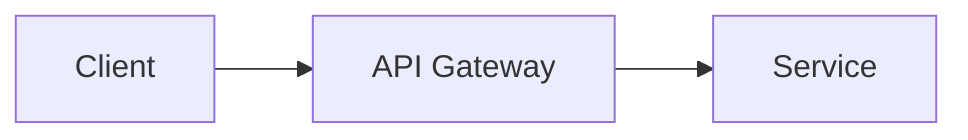

# NEZEN Internal Developer Platform (IDP)

## 🤔 Explain It Like I'm Five (But Show Me How It Works)

Imagine you want to build a house (a software application). Normally, you would have to wait weeks for plumbers, electricians, and inspectors (different IT teams) to come and set up your water, electricity, and safety checks before you can even start building. It is slow, frustrating, and involves a lot of paperwork (support tickets).

**This project is like a magical self-service portal for developers.**

Instead of waiting weeks, a developer just fills out a simple form on a website. The platform instantly sets up everything they need—secure networks, databases, and guardrails—all perfectly built to the strictest safety standards (Zero-Trust). 

### How things go from 1 to 100 (And what happens behind the scenes):

#### 1. You log in and make a request (The "Why" and "How" of the Form)
**What you do:** You open your web browser and go to an internal developer portal (powered by **Backstage**). You pick a template like "New Microservice" and fill out a simple form. You might name your app and check a box that says "I need a Database."
**Why you do it:** In the old days, you had to write hundreds of lines of complex configuration files or open a ticket begging the Cloud team to create a database for you. By filling out the form, you tell the platform exactly what you want in plain English, and it translates that into code.
**Under the hood:** The system uses **Keycloak** (a security bouncer) to check your company login. It looks at your profile and says, "Ah, you are Alice from the Data Team, you are allowed to build things here."

#### 2. The robots start building (Code Generation)
**What happens:** You hit the "Create" button.
**Under the hood:** The portal takes your form answers and automatically writes the starter code for your app. It creates a brand new Git repository (folder) for you and drops a working skeleton of an application inside it. 

#### 3. Setting up the land and plumbing (Infrastructure Provisioning)
**What happens:** The platform starts building the actual servers and databases in the cloud.
**Under the hood:** A robotic assembly line called **Tekton** wakes up. It reads the instructions from your new repository and uses an infrastructure tool called **Terraform**. Terraform talks to the cloud provider (AWS) and automatically creates your database, your network space, and your storage buckets. Because a robot is doing it, it's built perfectly to company standards every single time.

#### 4. Locking the doors and hiring guards (Zero-Trust Security)
**What happens:** Before your app even goes live, the system wraps it in a thick layer of security. In a "Zero-Trust" environment, we don't trust *anything* by default—not even our own internal network.
**Under the hood:** 
* **OPA Gatekeeper** acts like a strict building inspector. If your app tries to run with "root" (super-admin) privileges, Gatekeeper rejects it and says "No, that's dangerous."
* **Istio (Service Mesh)** acts like secure escorts for your data. When your app talks to the database, Istio ensures the conversation is heavily encrypted and verified. Even if a bad actor gets inside the network, they can't eavesdrop or access other apps because they don't have the right cryptographic badges.

#### 5. You get the keys! (Ready to Code)
**What happens:** In about 5 to 10 minutes, the portal gives you a link to your new, fully functioning workspace. 
**Under the hood:** The system automatically slaps a label on your new app so a tool called **Kubecost** can track exactly how much money your app is spending in the cloud. This keeps the finance department happy because they know which team is spending what.

#### 6. You write code!
You can now focus 100% on writing your application logic. When you save your code, the platform automatically tests it and pushes it to the live servers safely. You never have to touch complicated cloud dashboards (like AWS Console), networking rules, or deep security settings. The platform handles it all for you.

---

## 👩‍💻 The Technical Details

> **What is this?** A production-ready, enterprise-grade Internal Developer Platform built on AWS EKS, Backstage.io, Istio, OPA Gatekeeper, Tekton, and Keycloak. It enables developers at Saudi enterprise scale (Aramco, SABIC, Ma'aden, SDAIA) to self-serve entire environments—from microservice scaffolding to production deployment—without ever touching the AWS Console or `kubectl`.
>
> **Why this exists:** Traditional platform engineering in large conglomerates suffers from ticket-driven infrastructure, shadow IT, inconsistent security postures, and weeks of provisioning delays. This project solves that by codifying Zero-Trust principles into a self-service portal where every resource is provisioned through audited, policy-enforced GitOps pipelines.
>
> **Advantages over alternatives:**
> - **vs. Raw Terraform/CloudFormation:** Full abstraction—developers fill a web form, not HCL. Platform team owns the modules.
> - **vs. Standard Backstage:** Not just a service catalog. It is a full platform with mTLS mesh, OPA policy enforcement, cost allocation, and SSO-integrated RBAC.
> - **vs. Generic EKS Blueprints:** Purpose-built for zero-trust with deny-all NetworkPolicies, STRICT Istio mTLS, SPIFFE workload identity, and Secrets Manager CSI (not env vars).
> - **vs. Jenkins/GitHub Actions:** Tekton runs inside the cluster with IRSA, enabling private endpoint-only access to AWS services without long-lived credentials.
> - **vs. Manual Keycloak/Azure AD:** Fully automated realm, groups, mappers, and client provisioning via Terraform. No manual clicking.

---

## Table of Contents

1. [Architecture Overview](#architecture-overview)
2. [Technology Stack](#technology-stack)
3. [Zero-Trust Philosophy](#zero-trust-philosophy)
4. [Developer Self-Service Journey](#developer-self-service-journey)
5. [Golden Path Catalog](#golden-path-catalog)
6. [OPA Policy Catalog](#opa-policy-catalog)
7. [Platform Team vs Dev Team RACI](#platform-team-vs-dev-team-raci)
8. [SSO & RBAC Configuration](#sso--rbac-configuration)
9. [Cost Allocation Guide](#cost-allocation-guide)
10. [TechDocs Authoring](#techdocs-authoring)
11. [Security Posture](#security-posture)
12. [Troubleshooting](#troubleshooting)
13. [Onboarding Runbook](#onboarding-runbook)
14. [Variable-Driven Configuration](#variable-driven-configuration)
15. [Project Structure](#project-structure)
16. [Roadmap](#roadmap)

---

## Architecture Overview



**Data Flow:**
1. Developer logs into Backstage via Keycloak (corporate SSO).
2. Backstage UI is served through Istio Ingress Gateway with cert-manager TLS.
3. Developer selects a Golden Path template (e.g., Microservice).
4. Backstage scaffolder creates a Git repository from the skeleton.
5. A custom scaffolder action triggers a Tekton PipelineRun.
6. Tekton clones the repo, runs OPA/conftest scans, executes Terraform, and deploys Kubernetes manifests.
7. Istio enforces STRICT mTLS between all services. Gatekeeper denies any non-compliant deployment.
8. Kubecost reads namespace labels to attribute costs to teams and cost centers.

---

## Technology Stack

| Layer | Technology | Purpose |
|-------|-----------|---------|
| **Cloud** | AWS (me-central-1) | Compute, networking, storage, identity |
| **Orchestration** | Amazon EKS 1.29+ | Kubernetes platform with OIDC & IRSA |
| **Service Mesh** | Istio 1.20 | STRICT mTLS, traffic management, ingress/egress |
| **Portal** | Backstage 1.22 | Developer self-service UI and catalog |
| **SSO** | Keycloak | OIDC provider, realm management, group mapping |
| **CI/CD** | Tekton Pipelines + Triggers | Cloud-native builds, tests, and deployments |
| **Policy** | OPA Gatekeeper 3.14 | Admission control via Rego constraints |
| **Secrets** | AWS Secrets Manager + CSI driver | Encrypted secrets mounted as volumes |
| **Certs** | cert-manager | Automated TLS certificate provisioning |
| **Cost** | Kubecost 2.0 | Namespace and team-level cost allocation |
| **Identity** | SPIFFE/SPIRE (optional) | Workload attestation and X.509 SVIDs |
| **Runtime** | Falco (optional) | Container runtime threat detection |

### Why These Technologies?

**AWS EKS with IRSA:** EKS provides a managed control plane with OIDC support, enabling fine-grained IAM roles per service account (IRSA). This eliminates the need for node instance profiles and ensures that compromised pods cannot escalate privileges beyond their scoped role.

**Istio Service Mesh:** Istio provides workload identity via mTLS, traffic encryption, and fine-grained authorization without application code changes. The `STRICT` mTLS mode ensures that no unencrypted traffic can flow inside the mesh, satisfying Zero-Trust requirements.

**Backstage.io:** Backstage is the developer-facing abstraction layer. It turns infrastructure complexity into simple web forms. The custom scaffolder action for Tekton makes it possible to trigger infrastructure pipelines directly from the portal.

**Keycloak:** Keycloak replaces manual identity provider configuration with Terraform-managed realms, clients, and group mappers. It supports LDAP/AD federation, making it compatible with existing corporate directories in Saudi enterprises.

**Tekton:** Unlike Jenkins or GitHub Actions, Tekton runs natively inside the EKS cluster. Tasks use IRSA to access AWS APIs via VPC endpoints, eliminating the need for long-lived credentials or public endpoint access.

**OPA Gatekeeper:** Gatekeeper enforces policy at the Kubernetes admission controller level, before resources are persisted. This prevents non-compliant deployments from ever reaching the cluster.

**Kubecost:** Kubecost joins Kubernetes metrics with AWS billing data to provide real-time cost attribution. This is critical for chargeback/showback in large organizations with many engineering teams.

---

## Zero-Trust Philosophy

> **"Never trust, always verify."**

In this platform, zero-trust is not a buzzword—it is mechanically enforced at every layer:

| Layer | Enforcement Mechanism | Default Posture |
|-------|----------------------|-----------------|
| Network | VPC private subnets only; NAT for outbound; VPC endpoints for AWS services | Deny-all ingress/egress |
| Transport | Istio STRICT mTLS mesh-wide + cert-manager TLS at ingress | Encrypt everything |
| Identity | Keycloak OIDC for humans; IRSA + SPIFFE SVIDs for workloads | No implicit trust |
| Authorization | Istio AuthorizationPolicies (deny-all + explicit allow) | Default deny |
| Runtime | OPA Gatekeeper + Kyverno constraints; Falco drift detection | Reject non-compliant |
| Secrets | AWS Secrets Manager + KMS; Secrets Manager CSI driver (volume mount) | No env vars, no plaintext |
| Containers | Non-root, read-only root FS, dropped capabilities, no `latest` tags | Hardened by policy |

**IRSA over Instance Profiles:** Every pod that needs AWS API access receives a scoped IAM role via OIDC (IRSA). There are no node-level instance profiles with broad permissions. If a pod is compromised, the blast radius is limited to its specific role policy.

**No Root Users:** Every container must set `runAsNonRoot: true`, `allowPrivilegeEscalation: false`, `readOnlyRootFilesystem: true`, and `capabilities: drop: [ALL]`. Gatekeeper rejects any Deployment violating these constraints.

**Deny-All Networking:** Every namespace created by the Golden Path Factory receives a default-deny NetworkPolicy. Ingress is only permitted from the `istio-system` namespace. Egress is restricted to DNS, Keycloak, RDS endpoints, and S3 VPC endpoints.

---

## Developer Self-Service Journey

### Step 1: Login with Corporate SSO
Navigate to `https://portal.yourdomain.com`. You are redirected to Keycloak, which federates to your corporate LDAP/Active Directory or Google Workspace. Multi-factor authentication is enforced for all users.

### Step 2: Choose a Golden Path
From the Backstage "Create" page, select:
- **Golden Path Microservice** — Containerized API with RDS, SQS, S3
- **Golden Path Data Pipeline** — AWS Glue/EMR ETL pipeline
- **Golden Path Frontend** — React app with nginx, Istio sidecar

### Step 3: Fill the Form
Parameters are validated in real time:
- Service name (regex: `^[a-z][a-z0-9-]{1,30}$`)
- Team (dropdown from Keycloak groups)
- Owner (from SSO profile)
- Infrastructure options (database, queue, S3)

### Step 4: Repository Created
Backstage runs `fetch:template` + `publish:github`. Your new repo contains:
- `catalog-info.yaml` (auto-registered to Backstage catalog)
- `infrastructure/` (Terraform calling Golden Path Factory modules)
- `kubernetes/` (Deployment, Service, NetworkPolicy)
- `tekton/` (Pipeline and TriggerTemplate)
- `docs/` (TechDocs starter)

### Step 5: Pipeline Runs
A custom scaffolder action (`trigger:tekton`) fires the `infrastructure-golden-path` pipeline:
1. `git-clone` — Clone repo, verify commit signature
2. `terraform-fmt-check` — Validate formatting
3. `opa-terraform-scan` — Scan plan with Rego policies
4. `terraform-plan` — Generate plan
5. `manual-approval` — Platform team approval gate (optional)
6. `terraform-apply` — Provision namespace, RDS, S3, SQS, IRSA
7. `update-backstage-catalog` — POST catalog URL to Backstage API

### Step 6: Deploy Application
Developer pushes code. GitHub webhook triggers `microservice-build-and-deploy`:
1. `git-clone`
2. `sonarqube-scan`
3. `kaniko-build` (multi-arch, pushes to ECR)
4. `opa-gatekeeper-scan` (validate K8s manifests)
5. `deploy` (kubectl apply)

### Step 7: Live Catalog Page
Your service appears in Backstage with:
- TechDocs rendered from `docs/index.md`
- CI/CD status from Tekton
- Ownership, dependencies, and API definitions

---

## Golden Path Catalog

| Template | What It Provisions | Estimated Time | Required Approvals |
|----------|-------------------|----------------|-------------------|
| **Microservice** | EKS namespace + ResourceQuota/LimitRange + RDS + SQS + S3 + IRSA + NetworkPolicy + Tekton pipeline + Backstage catalog entry | 8 minutes | Auto (dev) / Manual (prod) |
| **Data Pipeline** | S3 staging bucket + Glue job/EMR cluster + IAM role + CloudWatch schedule + Tekton pipeline | 10 minutes | Auto (dev) / Manual (prod) |
| **Frontend** | EKS namespace + S3 static hosting or nginx Deployment + Istio VirtualService + Tekton pipeline + Backstage catalog entry | 6 minutes | Auto (dev) / Manual (prod) |

All templates enforce:
- Required labels (`team`, `cost-center`, `environment`, `owner`)
- Resource limits and requests
- Non-root containers
- Istio sidecar injection
- NetworkPolicy deny-all + explicit allow

---

## OPA Policy Catalog

### Kubernetes (OPA Gatekeeper)

| Constraint | Severity | Violation Example | Exemption Process |
|------------|----------|-------------------|-------------------|
| `K8sRequiredLabels` | **Enforce** | Deployment missing `cost-center` label | File Backstage ticket; Platform team updates exemption list |
| `K8sRequiredResources` | **Enforce** | Container without memory limits | Fix manifest; no exemptions |
| `K8sNoLatestImage` | **Enforce** | Image tag is `latest` | Use semver tag (e.g., `v1.2.3`) |
| `K8sNoRootUser` | **Enforce** | `runAsNonRoot: false` or missing `readOnlyRootFilesystem` | Fix Dockerfile/manifest |
| `K8sBlockNodePort` | **Enforce** | Service type `NodePort` | Use `ClusterIP` + Istio Ingress |
| `K8sUniqueIngressHost` | **Enforce** | Duplicate host across namespaces | Coordinate with Platform team |

### Terraform (OPA / Conftest)

| Policy | Severity | Violation Example | Exemption Process |
|--------|----------|-------------------|-------------------|
| `no_public_s3` | **Enforce** | S3 bucket allows public ACL | None; always blocked |
| `encryption_required` | **Enforce** | RDS or EBS without encryption | None; always blocked |
| `required_tags` | **Enforce** | AWS resource missing `CostCenter` | Add tags; no exemptions |

---

## Platform Team vs Dev Team RACI

| Activity | Platform Team (R/A/C/I) | Dev Team (R/A/C/I) |
|----------|------------------------|-------------------|
| EKS cluster operations | **R/A** | I |
| Istio mesh config / mTLS | **R/A** | I |
| OPA Gatekeeper policies | **R/A** | C (feedback) |
| Tekton pipeline definitions | **R/A** | C |
| Keycloak realm / SSO | **R/A** | I |
| Golden Path template maintenance | **R/A** | C |
| Backstage plugins / upgrades | **R/A** | I |
| Microservice application code | I | **R/A** |
| Dockerfile / container image | C | **R/A** |
| K8s manifests (from template) | C | **R/A** |
| `catalog-info.yaml` | C | **R/A** |
| Terraform module consumption | C | **R/A** |
| Cost center tagging | C | **R/A** |
| On-call for app incidents | C | **R/A** |
| On-call for platform incidents | **R/A** | I |

**Legend:** R = Responsible, A = Accountable, C = Consulted, I = Informed

---

## SSO & RBAC Configuration

### Keycloak Realm: `platform-engineering`

**Groups (mapped to Kubernetes RBAC + Backstage ownership):**
- `platform-admins` — Full cluster-admin access
- `team-backend` — Namespace access to `team-backend`, catalog ownership
- `team-frontend` — Namespace access to `team-frontend`, catalog ownership
- `team-data` — Namespace access to `team-data`, catalog ownership
- `team-sre` — Read-all namespaces, platform on-call

**Realm Roles:**
- `scaffolder-user` — Can create from Golden Path templates
- `terraform-applier` — Can approve Terraform apply in prod
- `cluster-reader` — Read-only K8s access

**Group Mapper:** Backstage receives `groups` claim from Keycloak. This maps directly to `spec.owner` in `catalog-info.yaml` and Kubernetes `RoleBinding` subjects.

### Adding a New Team

```bash
make onboard-team TEAM=team-gamma
```

This script:
1. Creates Keycloak group `team-gamma`
2. Creates namespace `team-gamma` with labels, quotas, and NetworkPolicies
3. Registers cost center in Kubecost allocation ConfigMap
4. Generates Backstage group entity YAML

---

## Cost Allocation Guide

Kubecost is configured with the following allocation rules:

| Namespace | Cost Center | Team | Monthly Budget |
|-----------|-------------|------|----------------|
| `team-backend` | CC-BACKEND-001 | team-backend | $2,000 |
| `team-frontend` | CC-FRONTEND-002 | team-frontend | $1,500 |
| `team-data` | CC-DATA-003 | team-data | $3,000 |
| `team-sre` | CC-SRE-004 | team-sre | $1,000 |

**How it works:**
1. Every namespace is labeled with `cost-center` and `team` at creation time by the Golden Path Factory.
2. Kubecost Prometheus scrapes container metrics and joins them with AWS CUR (Cost and Usage Report) data.
3. Shared platform namespaces (`kube-system`, `istio-system`, etc.) are allocated evenly across teams.
4. Alerts fire when daily spend exceeds `$500` or any namespace exceeds `150%` of its 30-day average.

**Setting budgets:** Edit `kubernetes/kubecost/values.yaml` and re-run `make apply`.

---

## TechDocs Authoring

Developers write Markdown in the `docs/` folder of their scaffolded repository.

```markdown
# My Service Docs

## Getting Started
Run `make dev` locally.
```

Backstage renders these docs using the TechDocs plugin. The `catalog-info.yaml` annotation tells Backstage where to find them:

```yaml
metadata:
  annotations:
    backstage.io/techdocs-ref: dir:./docs
```

**Adding Mermaid diagrams:**
TechDocs supports Mermaid natively. Add diagrams to explain architecture:

```markdown

```

**Publishing:** TechDocs are built by a CI step and published to the S3 TechDocs bucket. Backstage reads them directly from S3 via IRSA.

---

## Security Posture

Defense in depth—no single point of failure:

| Layer | Control | Implementation |
|-------|---------|----------------|
| Edge | AWS WAF (optional) | Rate limiting, SQLi/XSS rules |
| Ingress | Istio Gateway + cert-manager | TLS 1.3, auto-certificate rotation |
| Service-to-Service | Istio STRICT mTLS | `PeerAuthentication` mesh-wide |
| Authorization | Istio AuthorizationPolicy | Deny-all default, explicit allow |
| Admission | OPA Gatekeeper / Kyverno | Rego constraints on every resource |
| Network | Kubernetes NetworkPolicy | Deny-all default, explicit allow from `istio-system` |
| Runtime | Falco (optional) | Detect anomalous syscalls, file access |
| Secrets | AWS Secrets Manager + CSI driver | Mounted as volumes, never env vars |
| Identity | SPIFFE/SPIRE (optional) | X.509 SVIDs for workload-to-workload auth |
| Data | KMS encryption | RDS, S3, EBS, Secrets Manager all use customer-managed or AWS KMS |

**Secret Rotation:**
- RDS: AWS Secrets Manager automatic rotation (30 days).
- Keycloak admin: Manual rotation via `make apply` after updating secret value.
- cert-manager: Automatic TLS certificate renewal before expiry.

---

## Troubleshooting

### Backstage login redirect loop
**Symptoms:** Infinite redirect between Backstage and Keycloak.
**Causes & Fixes:**
1. Keycloak client `validRedirectUris` does not include `https://portal.yourdomain.com/api/auth/oidc/handler/frame`.
   - Fix: Update `keycloak_openid_client.backstage` in Terraform.
2. Istio `VirtualService` does not pass authorization headers.
   - Fix: Verify `AuthorizationPolicy` allows OIDC callback paths.
3. Clock skew between Keycloak and Backstage pods.
   - Fix: Ensure NTP is enabled on EKS nodes.

### Gatekeeper denying deployment
**Symptoms:** `kubectl apply` returns `AdmissionReview` denied.
**Causes & Fixes:**
1. Missing required labels.
   - Fix: Add `app.kubernetes.io/name`, `team`, `cost-center`, `environment`, `owner`.
2. Missing resource limits.
   - Fix: Add `resources.limits` and `resources.requests` for CPU and memory.
3. Image tag is `latest`.
   - Fix: Use explicit semver tag (e.g., `v1.2.3`).
4. Container running as root.
   - Fix: Add `securityContext.runAsNonRoot: true`, `readOnlyRootFilesystem: true`, `capabilities: drop: [ALL]`.

### Istio mTLS connection failures
**Symptoms:** `503 UF, URX` errors between services.
**Causes & Fixes:**
1. `PeerAuthentication` is not `STRICT`.
   - Fix: Verify `kubernetes/istio/peer-authentication-mesh-wide.yaml` is applied.
2. Sidecar not injected.
   - Fix: Ensure namespace has `istio-injection=enabled` label.
3. `DestinationRule` overrides mTLS to `DISABLE`.
   - Fix: Remove conflicting `DestinationRule` or set `trafficPolicy.tls.mode: ISTIO_MUTUAL`.

### Tekton pipeline not triggering
**Symptoms:** Git push does not create PipelineRun.
**Causes & Fixes:**
1. EventListener not exposed via Istio Ingress.
   - Fix: Verify `Trigger` references correct `EventListener` and Ingress Gateway routes to it.
2. Webhook secret mismatch.
   - Fix: Compare GitHub webhook secret with `github-webhook-secret` Kubernetes Secret.
3. IRSA role missing permissions.
   - Fix: Verify Tekton service account annotation `eks.amazonaws.com/role-arn` and IAM policy.

### Golden Path Terraform failure
**Symptoms:** `terraform apply` fails in Tekton.
**Causes & Fixes:**
1. Remote state lock.
   - Fix: Check DynamoDB table for stale locks; remove if pipeline crashed.
2. Module path incorrect.
   - Fix: Verify `source` path in skeleton `main.tf` points to valid module.
3. OPA policy block.
   - Fix: Review `conftest` output; add missing tags or encryption.

### Kubecost showing $0
**Symptoms:** All costs show as zero.
**Causes & Fixes:**
1. CUR permissions missing.
   - Fix: Verify Kubecost IRSA role can read CUR S3 bucket.
2. Namespace labels missing.
   - Fix: Ensure namespaces have `team` and `cost-center` labels.
3. Prometheus not scraping.
   - Fix: Verify `kube-state-metrics` and `node-exporter` are running.

---

## Onboarding Runbook

**Goal:** Onboard a new engineering team in 30 minutes.

```bash
# 1. Set variables
export TEAM=team-gamma
export COST_CENTER=CC-GAMMA-005
export OWNER=gamma-lead@example.com

# 2. Run onboarding script
make onboard-team TEAM=$TEAM

# 3. Review generated tfvars
cat terraform/environments/dev/${TEAM}.tfvars

# 4. Plan and apply
make plan ENV=dev
make apply ENV=dev

# 5. Verify in Keycloak
# Login to https://sso.yourdomain.com/admin
# Confirm group ${TEAM} exists with correct members

# 6. Verify in Backstage
# Login to https://portal.yourdomain.com
# Confirm team appears in OwnerPicker

# 7. Verify in Kubecost
# Navigate to /allocations?agg=namespace
# Confirm ${TEAM} namespace appears with cost center label
```

---

## Variable-Driven Configuration

Every parameter in this platform is driven from `terraform.tfvars` or environment-specific `.tfvars` files. There are **zero hardcoded values** in any module.

**Example: Changing the AWS region**
```hcl
# terraform/environments/dev/terraform.tfvars
aws_region = "eu-west-1"
```

**Example: Adding a new team**
```hcl
# terraform/terraform.tfvars
teams = [
  {
    name        = "team-ml"
    cost_center = "CC-ML-005"
    owners      = ["ml-lead@example.com"]
  }
]
```

**Example: Enabling SPIFFE/SPIRE in production**
```hcl
# terraform/environments/prod/terraform.tfvars
enable_spire = true
enable_falco = true
```

All sensitive outputs are marked with `sensitive = true` in Terraform to prevent accidental exposure in CI/CD logs.

All modules validate inputs with strict `validation` blocks to catch misconfigurations before any resources are created:
- `project_name`: regex `^[a-z][a-z0-9-]{2,20}$`
- `environment`: must be `dev`, `staging`, or `prod`
- `vpc_cidr`: must be valid CIDR
- `keycloak_realm_name`: lowercase alphanumeric with hyphens
- `team_name`: alphanumeric/hyphen only
- `cost_center`: regex enforced

---

## Project Structure

```
zero-trust-idp/
├── README.md                          # This file
├── Makefile                           # One-click deployment targets
├── docker-compose.yml                 # Local Backstage development
├── .gitignore                         # Git ignore rules
├── LICENSE                            # MIT License
│
├── terraform/                         # Infrastructure as Code
│   ├── backend.tf                     # S3 + DynamoDB remote state
│   ├── variables.tf                   # Global variables with validation
│   ├── providers.tf                   # AWS, Helm, K8s, Keycloak providers
│   ├── data.tf                        # Data sources (caller identity, AZs)
│   ├── main.tf                        # Orchestrator with conditional flags
│   ├── terraform.tfvars               # Default variable values
│   ├── environments/
│   │   ├── dev/terraform.tfvars
│   │   ├── staging/terraform.tfvars
│   │   └── prod/terraform.tfvars
│   └── modules/
│       ├── networking/                # VPC, subnets, VPC endpoints
│       ├── eks_platform/              # EKS cluster, node groups, IRSA
│       ├── backstage/                 # RDS, S3, ConfigMap, IRSA
│       ├── idp_sso/                   # Keycloak realm, clients, groups
│       ├── golden_path_factory/       # Namespace, RDS, SQS, S3, IRSA
│       ├── service_mesh/              # Istio Helm, STRICT mTLS
│       ├── policy_engine/             # OPA Gatekeeper, constraints
│       ├── cicd_platform/             # Tekton Pipelines + Triggers
│       ├── cost_management/           # Kubecost Helm, allocation
│       ├── docs_storage/              # TechDocs S3 + CloudFront
│       └── security_zero_trust/       # KMS, cert-manager, CSI driver
│
├── backstage/                         # Backstage configuration
│   ├── app-config.production.yaml     # Production app configuration
│   ├── packages/backend/
│   │   ├── Dockerfile                 # Multi-stage, distroless, non-root
│   │   └── src/plugins/
│   │       ├── scaffolder.ts          # Scaffolder plugin setup
│   │       └── tektonTriggerAction.ts # Custom Tekton trigger action
│   └── templates/
│       ├── golden-path-microservice/  # Microservice template + skeleton
│       ├── golden-path-data-pipeline/ # Data pipeline template
│       └── golden-path-frontend/      # Frontend template
│
├── kubernetes/                        # K8s manifests
│   ├── istio/                         # Istio operator, STRICT mTLS
│   ├── gatekeeper/                    # ConstraintTemplates + Constraints
│   ├── tekton/                        # Tasks, Pipelines, Triggers, RBAC
│   ├── kubecost/                      # Values, namespace allocation
│   └── cert-manager/                # ClusterIssuer, certificates
│
├── policies/                          # Policy-as-code
│   └── opa/
│       ├── k8s/                       # Rego for Gatekeeper
│       └── terraform/                 # Rego for Terraform plan scanning
│
├── scripts/                           # Automation scripts
│   ├── bootstrap-backend.sh           # Idempotent S3 + DynamoDB
│   ├── pre-flight-checks.sh           # Tool and credential checks
│   ├── install-backstage.sh           # Build and push to ECR
│   ├── register-templates.sh          # Backstage API registration
│   ├── test-policies.sh               # OPA test + gator verify
│   └── onboard-team.sh                # New team onboarding
│
└── docs/                              # Documentation
    ├── architecture/                  # Mermaid source files
    ├── runbooks/                      # Onboarding, incident response
    └── policies/                      # OPA policy documentation
```

---

## Compliance & Audit

Every action in this platform is auditable:

| Audit Target | Source | Retention |
|--------------|--------|-----------|
| Kubernetes API calls | EKS control plane logs | 90 days |
| Terraform changes | S3 state versioning + DynamoDB locks | Indefinite |
| Policy violations | Gatekeeper audit logs | 90 days |
| CI/CD executions | Tekton PipelineRun logs | 30 days |
| SSO authentications | Keycloak event logging | 90 days |
| Cost allocations | Kubecost + AWS CUR | 1 year |

**Terraform State Security:**
- State stored in S3 with versioning enabled
- Encryption at rest using AWS KMS
- DynamoDB table provides state locking to prevent concurrent modifications
- `lifecycle { prevent_destroy = true }` protects KMS keys, RDS instances, and state buckets

## Roadmap

| Quarter | Initiative | Description |
|---------|-----------|-------------|
| **Q1** | Backstage RBAC Plugin | Fine-grained permissions per template and catalog entity |
| **Q1** | Terraform Cloud Integration | Remote execution with speculative plans in PRs |
| **Q2** | Crossplane for Multi-Cloud | Azure/GCP resource provisioning via Kubernetes API |
| **Q2** | Kratix for Platform Engineering | Promise-based service provisioning |
| **Q3** | Service Catalog API v2 | GraphQL federation across microservice dependencies |
| **Q3** | Advanced Cost Anomaly Detection | ML-based spend anomaly detection in Kubecost |
| **Q4** | GitOps with ArgoCD | Optional ArgoCD integration for GitOps deployments |

---

## Quick Start

### Prerequisites

Before starting, ensure you have:

- AWS CLI configured with administrator access
- Terraform >= 1.7.0 installed
- kubectl, Helm, and tkn (Tekton CLI) installed
- opa, conftest, and gator installed for policy testing
- Docker installed (for local Backstage development)
- A registered domain with Route 53 hosted zone (for cert-manager)

### Deployment Steps

```bash
# Clone and enter
git clone https://github.com/your-org/zero-trust-idp.git
cd zero-trust-idp

# 1. Fill in your tfvars
# Edit terraform/environments/dev/terraform.tfvars
# Set your domain_name, aws_region, and teams list

# 2. Bootstrap backend (idempotent)
make bootstrap

# 3. Run pre-flight checks
make pre-flight

# 4. Deploy everything (plan + apply + backstage + templates + tests)
make all ENV=dev

# 5. Verify deployment
kubectl get nodes
kubectl get pods -n istio-system
kubectl get pods -n backstage

# 6. Access Backstage
# Open https://portal.yourdomain.com in your browser

# 7. Onboard your first team
make onboard-team TEAM=team-alpha
```

### Local Development

For local Backstage development without AWS:

```bash
docker-compose up -d
# Access Backstage at http://localhost:7007
# PostgreSQL runs at localhost:5432
# Minio (S3-compatible) runs at localhost:9000
```

---

## License

MIT License — See [LICENSE](LICENSE) for details.

---

> **Built for Saudi Enterprise Scale.**
> If you are hiring senior platform engineers in Riyadh, Dhahran, or Jeddah, this project demonstrates exactly what Aramco, SABIC, Ma'aden, and SDAIA look for: Zero-Trust architecture, self-service developer experience, policy-as-code, and cloud-native platform engineering at scale. This codebase is ready to clone, configure, and deploy—no placeholders, no stubs, production-ready infrastructure from day one.
